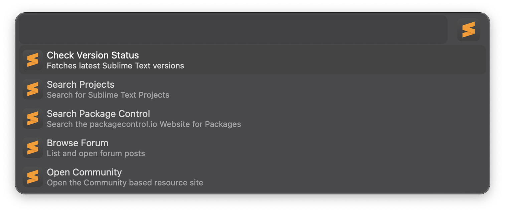
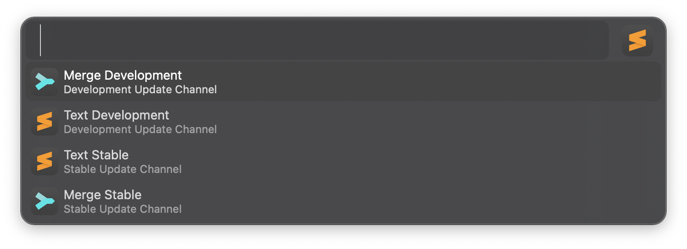
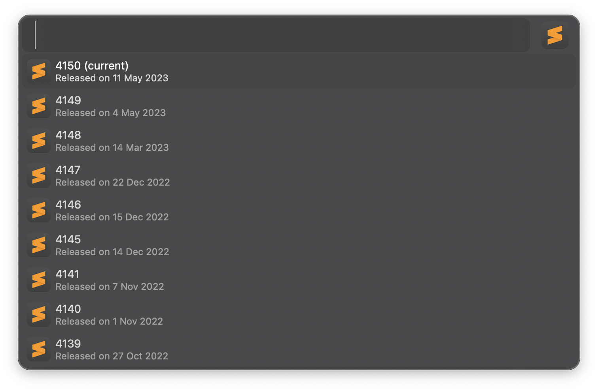
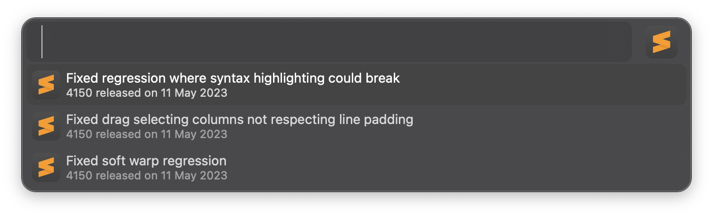
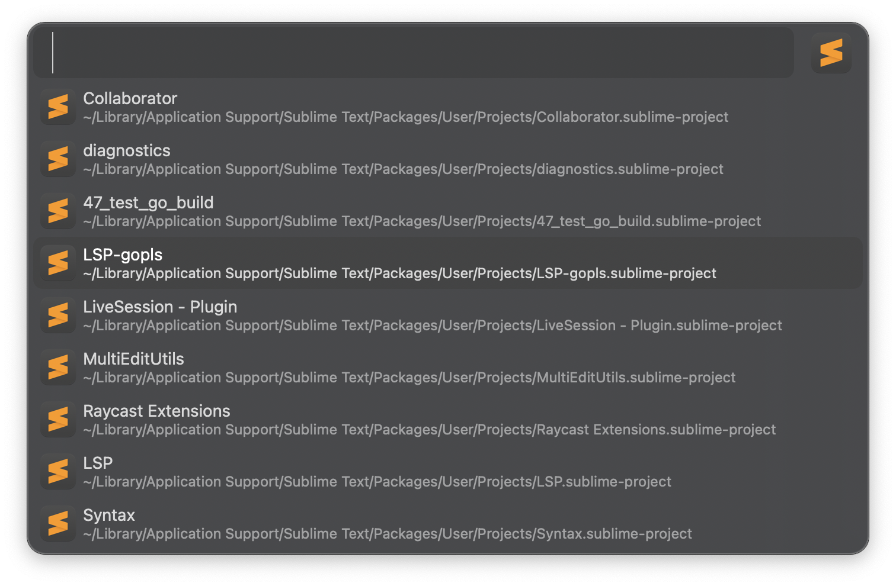
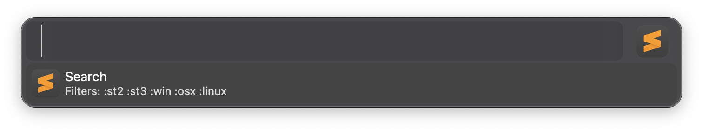
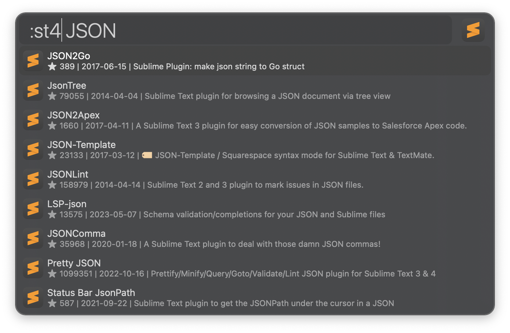
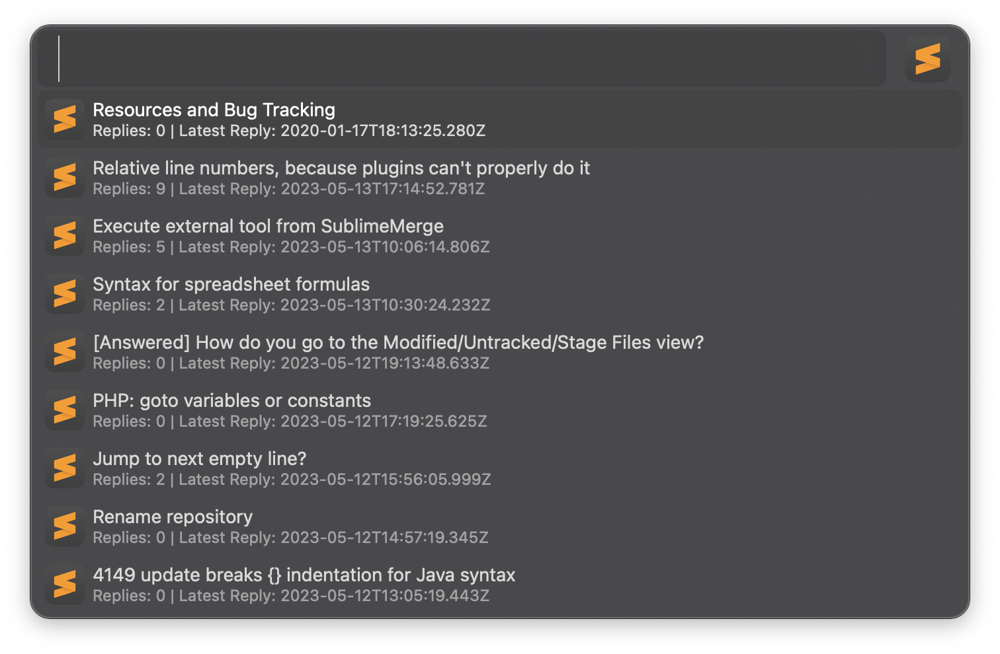

## Sublime HQ Assistant

This workflow is a Alfred to your Sublime Text. It aims to provide the following

- `search` Sublime Text projects which are local on your machine
- `search` Package Control and `install` packages from Alfred
- View Sublime Text and Merge Updates. Supports both `development` and `stable` channels
- Browse the Sublime Forum from within Alfred!
- Quick link to the Community site

# Home

# Sublime HQ - Products / Channels

# Sublime HQ - Product Builds

# Sublime HQ - Product Changelog

# Project Search

# Package Control Search

# Package Control Results

# Forum Browsing

